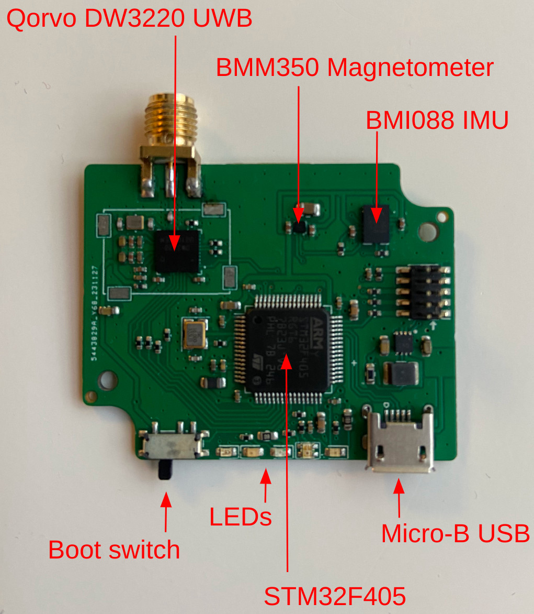

# STM32 Pose sensor

Welcome to the user manual for the STM32 standalone Pose sensor.

This manual covers the installation of the STM32 code for the devices and the host code for retrieving the data and running the positioning and orientation applications.

The device is illustrated below with its various sensors. It is run by a STM32 and it has the following sensors:
- [Qorvo DW3220](https://www.qorvo.com/products/p/DW3220) UWB with RP-SMA female connector.
- [Bosch BMI088](https://www.bosch-sensortec.com/products/motion-sensors/imus/bmi088/) IMU with triaxial accelerometer and triaxial gyroscope. The BMI088 is a high-performance IMU used in harsh environments such as those in drones and robotics applications. It has a high vibration robustness and temperature stability.
- [Bosch BMM350](https://www.bosch-sensortec.com/products/motion-sensors/magnetometers/bmm350/) triaxial magnetometer with high accuracy and ultra-low noise.

## Table of Contents


