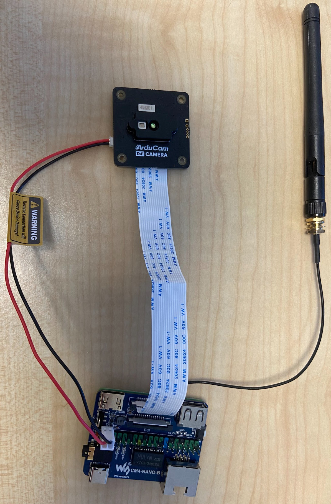

# Assemble wireless ToF sensor

The wireless ToF sensor is a do-it-yourself project. You need a Raspberry Pi 4 or Raspberry Pi CM4. For good WiFi performance, we recommend a CM4 with
an external antenna as explained in the [Build it yourself](/manual/setup/build_it_yourself) section. You also need an [Arducam ToF sensor](https://www.arducam.com/time-of-flight-camera-raspberry-pi/).

**Steps (assuming CM4)**
- Attach CM4 module to carrier board.
- Flash CM4 module with Raspberry Pi OS 64 bit lite using the Raspbery Pi Imager tool. We tested it with kernel 6.1.21 but others are likely to work.
- Make sure you can SSH into the Raspberry Pi.
- To enable camera (CSI) on the Waveshare Nano B carrier board, do the following:
```bash
sudo apt-get install p7zip-full -y
wget https://files.waveshare.com/upload/4/41/CM4_dt_blob.7z
7z x CM4_dt_blob.7z -O./CM4_dt_blob
sudo chmod 777 -R CM4_dt_blob
cd CM4_dt_blob/
# If using two cameras and DSI1, execute
sudo  dtc -I dts -O dtb -o /boot/dt-blob.bin dt-blob-disp1-double_cam.dts
#When using any DSI, HDMI1 has no image output, even if you do not connect the DSI screen, as long as the corresponding file is compiled, then HDMI1 will not output.
#If you need to restore, delete the corresponding dt-blob.bin: sudo rm -rf /boot/dt-blob.bin
# After execution, turn off the power and restart the CM4.
```
- Attach the MIPI cable from the ToF sensor and the power cable to pins 4 (5V) and 6 (GND) as shown in photo below.
- To the bottom of /boot/config.txt, add
```bash
dtoverlay=arducam-pivariety,media-controller=0
```
and comment out this line like this:
```bash
#camera_auto_detect=1
```
- Reboot
- Follow the [ToF example instructions](https://github.com/MayFly-AI/picam/tree/main/python/examples/tof_camera).

After attachiching everything, it will look like this:



