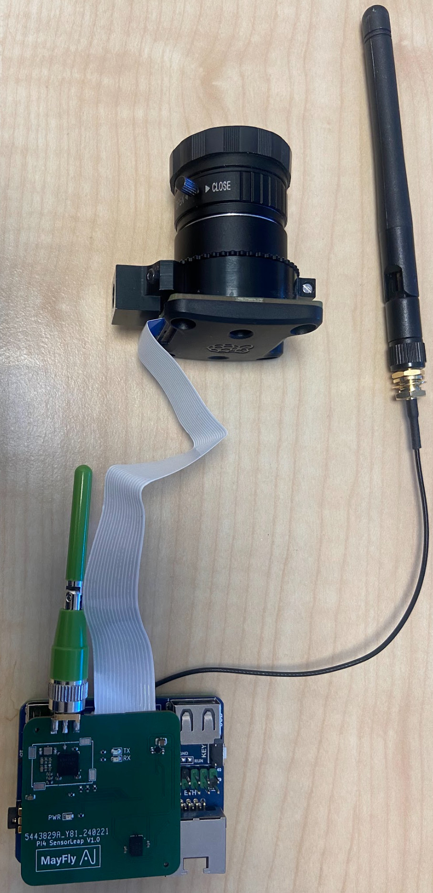

# Build it yourself

We are using the Raspberry Pi Compute Module 4 (CM4) due to its small form factor, H.264 video encoder and the option to add an external antenna, which we found to be critical for decent WiFi performance and range. Our regular build is:

- Raspberry Pi CM4 with WiFi (we used version with 8GB eMMC storage and 2GB RAM)
- Waveshare Nano B carrier board
- CM4 approved external antenna for WiFi
- Raspberry Pi Global Shutter Camera
- 6mm Wide Angle Lens for Raspberry Pi HQ Camera (CS-mount)
- Pose sensor (Raspberry Pi HAT version) 
- Antenna for Pose sensor

If you are using the CM4, you can use any carrier board that you like. You can also use a regular Raspberry Pi 4 but WiFi performance will not be as good.
We have also tested it with the Raspberry Pi Zero 2 W which works but it only has 2.4GHz WiFi which tends to be crowded resulting in worse WiFi performance. The bandwidth on 2.4GHz WiFi is also smaller meaning the amount of sensor data to stream needs to be limited. We have it working OK with 640x480 30 FPS streams.

You can use other cameras. We have tried V2 and HQ. We recommend to use the Global Shutter camera if you are going to do SLAM. V3 camera should also work but we have not tested it yet.

**Steps:**

- Attach CM4 module to carrier board
- Flash CM4 module with Raspberry Pi OS 64 bit lite using the Raspbery Pi Imager tool. We tested it with kernel 6.1.21 but others are likely to work.
- Make sure you can SSH into the Raspberry Pi.
- Attach camera to carrier board.
- In /boot/config.txt, comment out the line like this:
```bash
#camera_auto_detect=1
```
and add the following 2 lines in the bottom of the file:
```bash
dtoverlay=dwc2,dr_mode=host
dtoverlay=imx296,cam0
```
The first line is specific to Waveshare Nano B carrier board. It may be different for your choice of carrier boards. It enables the USB port if you need it. See waveshare [instructions](https://www.waveshare.com/wiki/CM4-NANO-B). The second line specifies the camera. Note that the Global Shutter camera is imx296. If you have a V2 camera, you need to write imx219 and for HQ camera use imx477.
- To enable camera (CSI) on the Waveshare Nano B carrier board, do the following:
```bash
sudo apt-get install p7zip-full -y
wget https://files.waveshare.com/upload/4/41/CM4_dt_blob.7z
7z x CM4_dt_blob.7z -O./CM4_dt_blob
sudo chmod 777 -R CM4_dt_blob
cd CM4_dt_blob/
# If using two cameras and DSI1, execute
sudo  dtc -I dts -O dtb -o /boot/dt-blob.bin dt-blob-disp1-double_cam.dts
#When using any DSI, HDMI1 has no image output, even if you do not connect the DSI screen, as long as the corresponding file is compiled, then HDMI1 will not output.
#If you need to restore, delete the corresponding dt-blob.bin: sudo rm -rf /boot/dt-blob.bin
# After execution, turn off the power and restart the CM4.
```
- Reboot and test that you can use libcamera (sudo apt install libcamera-apps). Try to run:
```bash
libcamera-vid -o example.h264
```
It should output a movie file.
- Follow the [Getting started](/manual/setup/gettingstarted/) instructions.

## Connect to WiFi
To /etc/wpa_supplicant/wpa_supplicant.conf, add 
```bash
network={
        ssid="wifiname"
        psk="wifipass"
}
```
with the name of your own WiFi access point and associated password. Reboot and check that it is connected with ifconfig.

## Use external antenna
To get good WiFi performance, attach the CM4 external antenna to the ipex on the CM4 and add the following line to the bottom of the /boot/config.txt
```bash
dtparam=ant2
```
Reboot and check that WiFi is still working.

## Attach Pose Sensor (Raspberry Pi HAT)
Attach Raspberry Pi HAT Pose sensor to pins 13-28 on the 40-pin header. There needs to be 6 free rows of pins on each side.

Also modify these 2 lines in /boot/config.txt such that 
```bash
dtparam=i2c_arm=on
dtparam=spi=on
```

Next add this line to /etc/modules
```bash
i2c-dev
```

Reboot and confirm that 
```bash
ls /dev/i2c-*
```
outputs /dev/i2c-0 and /dev/i2c-1.

You are now ready to run the UWB, IMU and magnetometer examples.

After attachiching everything, it will look like this:



## Enclosure
The enclosure can be 3D printed but for heat dissipation we recommend getting it CNC machined in anodized aluminum. The STL files for the base and the lid for the enclosure is in this [GitHub repository](https://github.com/MayFly-AI/stm32-pi4-hw/tree/main/3d/pi4). To assemble the enclosure, you need 6 M2.5 8mm countersunk screws and 4 M2.5 nuts. The Global Shutter camera has a mount attached with 2 screws. You need to detach this mount to insert the camera in the enclosure and then reattach the mount rotated 180 degrees once inserted. Then inside enclosure, screw on 4 screws with nuts. Use a small pointy object to keep the nuts from spinning while screwing. Attach the MIPI cable to the Nano B carrier board and attach the external antenna and the Pose sensor. Insert attached CM4+NanoB+Pose sensor into the enclosure and make sure the standoffs in the base hits the CM4 PCB holes. Screw base and lid together.

We are considering designing a 3D printable enclosure using an off-the-shelf CM4 heatsink but we have not done this yet. If you design one and wish to share it, let us know.


