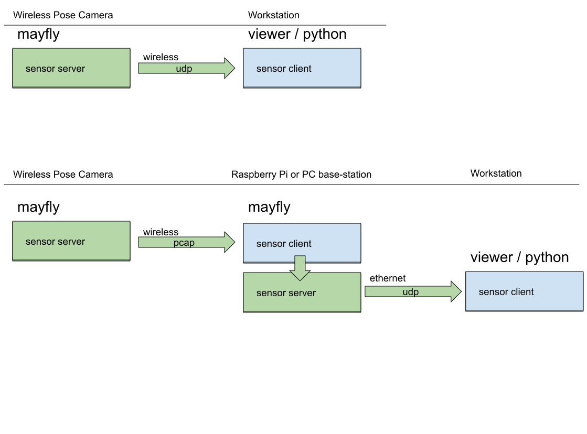

# Programs

The software or applications available with mayfly comes in three parts.

1. The `mayfly` application, which is typically run on the sensor device and possibly as a base-station for relaying sensor data

1. The `mayfly` python package, which provides an API for receiving the streaming data within python.

1. The `viewer` application, which is useful for monitoring streaming meta-data such as latency and data bandwidth.

# Architecture

The flexibility of the programs offers many possible configurations. Bellow is an illustration of two example setups.
Arrows show the direction of streaming sensor data, such as video.

The upper part of the diagram illustrates the high level overview of how the Wireless Pose Camera is sending sensor data to the viewer or a python program running on a workstation. In this example passing data over a regular 5Ghz wireless connection as UDP packets.

The lower part of the diagram shows another setup. Here the Wireless Pose Camera (left) sends data in monitor mode with forward error correction (FEC) to an intermediary base-station (middle), which can be any small computer, such as a Raspberry Pi. The base-station is running the `mayfly` program with a client receiving data from the sensor and a server providing data to the workstation (right).

Multiple base-stations are supported. This helps cover larger areas of operation when the sensor is mobile. The redundancy of data is handled at the reception on the workstation sensor-client. It fuses the incoming data from all base-stations.
